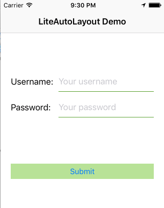
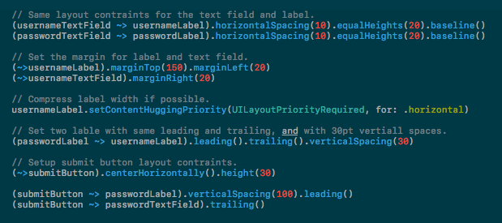

*喜欢这个项目？* `点解Star按钮支持我们吧!`

### 语言

[English](./README.md)

## 示例项目

可以下载 Demo 文件夹下的示例项目运行，下面是运行后的截图。



这是一个使用 LiteAutoLayout 编写布局约束的登录框界面，所有的约束代码都在下面的代码截图中：




### 简介

最近在用 Swift 3.0，Swift 3.0给我们带来了很多新的特性，在学习过程中发现自定义操作符这个写法很适合来写 autolayout 的约束，结合自己平时使用 IB 来创建视图之间的约束的经验，决定使用自定义操作符来让使用代码创建约束更加直观，清晰和简单。

其中，`~>` 这个符号被我用来作为视图约束于其同级视图或者父级视图的表达式，如 `(view1 ~> view2)`, 中间需要留空格，而创建对于自身的约束，可以使用`(~>view1)`来创建，中间不需要留空格，后面添加约束是用的简单方便的链式写法。

当然，如果你不想使用`~>`这个符号来创建约束，我还提供了startLayout()的方法直接创建约束，如：

```swift
view1.startLayout(toView: view2)。
```

另外，因为项目中使用 IB 编写界面比较多，同时也觉得 IB 添加约束的用法比较简单和方便，所以这里使用的设置约束的方法是用了 IB 添加约束的概念，相信有用过 IB 应该都比较容易接受这种写法，在使用 LiteAutoLayout 后相信会加深对 IB 添加布局约束的理解，两种的使用相互促进，相互提高，这也是这个库的优势之一。

### 比较 NSLayoutConstraint vs NSLayoutAnchor vs LiteAutoLayout

如设置两个视图之间垂直的距离约束`verticalSpacing()`, 值得注意的是`~>`后面的视图默认是在上方，如果是添加水平距离，则~>后面的视图是在左边。

这个库是一个简单的封装，如果你使用过 sdk 原始创建约束的方法的话，你应该会被其繁琐的写法所吓倒。

这里引用 apple 官网的一个例子：

```swift
// 使用 NSLayoutConstraint 创建约束
NSLayoutConstraint(item: subview,
                   attribute: .Leading,
                   relatedBy: .Equal,
                   toItem: view,
                   attribute: .LeadingMargin,
                   multiplier: 1.0,
                   constant: 0.0).active = true
 
NSLayoutConstraint(item: subview,
                   attribute: .Trailing,
                   relatedBy: .Equal,
                   toItem: view,
                   attribute: .TrailingMargin,
                   multiplier: 1.0,
                   constant: 0.0).active = true
 
 
// 使用 Layout Anchors 创建相同的约束
let margins = view.layoutMarginsGuide
 
subview.leadingAnchor.constraintEqualToAnchor(margins.leadingAnchor).active = true
subview.trailingAnchor.constraintEqualToAnchor(margins.trailingAnchor).active = true
```

上面可以看到直接使用 NSLayoutConstraint 创建简单的布局约束需要繁复的代码，使用 NSLayoutAnchor 可以简化约束代码，那 LiteAutoLayout 到底表现如何，下面我们用 LiteAutoLayout 创建相同的布局约束：

```swift
// 使用 Lite Auto Layout 创建相同的约束
(subview ~> view).leading().trailing()
```

显然，使用 LiteAutoLayout 甚至比 NSLayoutAnchor 还简单，并且代码阅读更加清晰易懂，而且 NSLayoutAnchor 目前只支持 iOS9+，LiteAutoLayout 目前支持 iOS7+。

最后，需要注意的是：
* 左边是子视图，右边为父视图(`subview ~> view`, 左侧的subview 是 view 的子视图)。
* 左边是位于右边的视图的右侧或者下方(`view2 ~> view1`, 则 view2 在 view1的右侧或者下方)。

目前支持的特性：
1. 支持>=, <=, ==操作符。
2. 支持指定优先级。
3. 支持链式写法。

## 如何安装

下载文件 LiteAutoLayout.swift 并将其复制到项目文件夹下，添加引用到项目中即可。

### 使用 LiteAutoLayout?

如果你在你的项目中使用了 LiteAutoLayout，请发邮件(邮件地址在下面)告诉我一声，我会把你的 app 的下载链接添加到这里！

## 贡献

欢迎为此项目提供任何的帮助，包括意见建议，资金，代码或者精神鼓励等，为此项目贡献代码请提交 pull request, 代码经过审核后会立即合并到主分支中。

### 关于创建者

我是 Mellong, 可以发邮件联系我 E-Mail: <tendencystudio@gmail.com>

个人网站: [http://blog.devlong.com](http://blog.devlong.com)

## 更多

想了解更多? 关注我的 `微信` 公众号 `mellong`:


### License

MIT License
